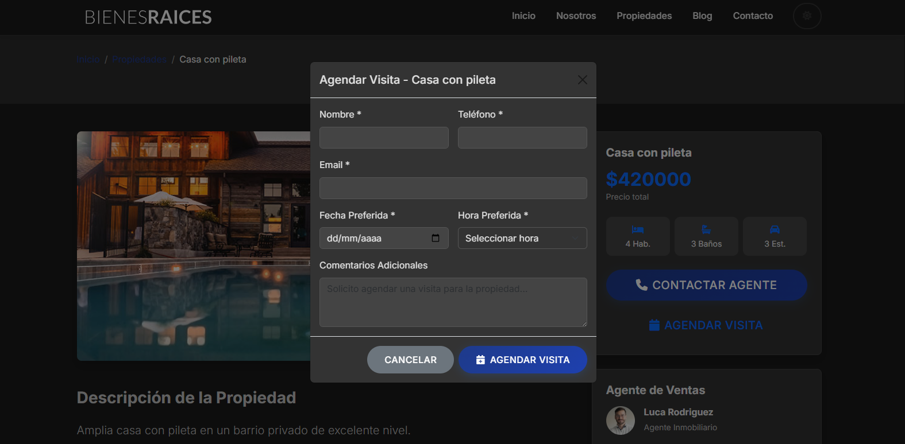

# Premium Real Estate - Property Management System


## 🌟 About the Project

A Django-based web application for managing and showcasing real estate properties. The platform allows users to browse properties, schedule visits, contact agents, and stay informed through the corporate blog.

## ✨ Key Features

- **Property Catalog**
  - Advanced search with filters
  - Image gallery
  - Complete property details

- **Visit Management**
  - Visit request system
  - Automatic email confirmation
  - Admin panel for management

- **Newsletter System**
  - Email subscription management
  - Double opt-in confirmation
  - Automatic notifications

- **Email Management**
  - Automatic email confirmations for all interactions
  - Two-way communication tracking
  - Admin notification system

- **Corporate Blog**
  - Real estate market articles
  - Categories and tags
  - Comments and social sharing

- **Admin Panel**
  - Complete property management
  - Visit and contact control
  - Statistics and reports

## 🛠️ Technologies Used

- **Backend:** Python 3.8+, Django 4.1.3
- **Frontend:** HTML5, CSS3, JavaScript, Bootstrap 5
- **Database:** SQLite (development) / MySQL (production)
- **Dependencies:**
  - python-dotenv 1.0.0
  - Pillow 10.0.1

## 📸 Screenshots

### Property Listings


*Comprehensive property listings with filtering options*

### Property Details

*Detailed property view with image gallery and key features*

### Contact Agent

*Direct agent contact form*

### Schedule a Visit

*Convenient visit scheduling interface*

### Corporate Blog

*Informative blog section with real estate articles*

### Admin Panel

*Comprehensive administration interface*

## 🚀 Setup Instructions

### English
1. **Environment Setup**
   - Ensure Python 3.8+ is installed
   - Install dependencies:
   ```bash
   pip install Django==4.1.3 python-dotenv==1.0.0 Pillow==10.0.1
   ```

2. **Environment Configuration**
   - Copy .env.example to .env
   - Configure environment variables as needed

3. **Start Development Server**
   ```bash
   python manage.py runserver
   ```

4. **Access the Application**
   - Homepage: http://127.0.0.1:8000 or http://localhost:8000
   - Admin Panel: http://127.0.0.1:8000/admin

### Español
1. **Configuración del Entorno**
   - Asegúrate de tener Python 3.8+ instalado
   - Instala las dependencias:
   ```bash
   pip install Django==4.1.3 python-dotenv==1.0.0 Pillow==10.0.1
   ```

2. **Configuración del Archivo .env**
   - Copia el archivo .env.example a .env
   - Configura las variables de entorno según sea necesario

3. **Iniciar el Servidor de Desarrollo**
   ```bash
   python manage.py runserver
   ```

4. **Acceso a la Aplicación**
   - Página principal: http://127.0.0.1:8000 o http://localhost:8000
   - Panel de administración: http://127.0.0.1:8000/admin

### Admin Credentials | Credenciales de Administrador
- Username | Usuario: `admin`
- Password | Contraseña: `testpassword`

### To create a new superuser | Para crear un nuevo superusuario:
```bash
python manage.py createsuperuser
```
Follow the on-screen instructions | Sigue las instrucciones en pantalla

## 📝 License | Licencia

This project is licensed under the MIT License. | Este proyecto está bajo la Licencia MIT.

## 📞 Contact | Contacto

For more information, please contact: | Para más información, por favor contacta a:
repettoalejandroing@gmail.com

---

Developed with ❤️ by Alejandro Repetto | 2025
